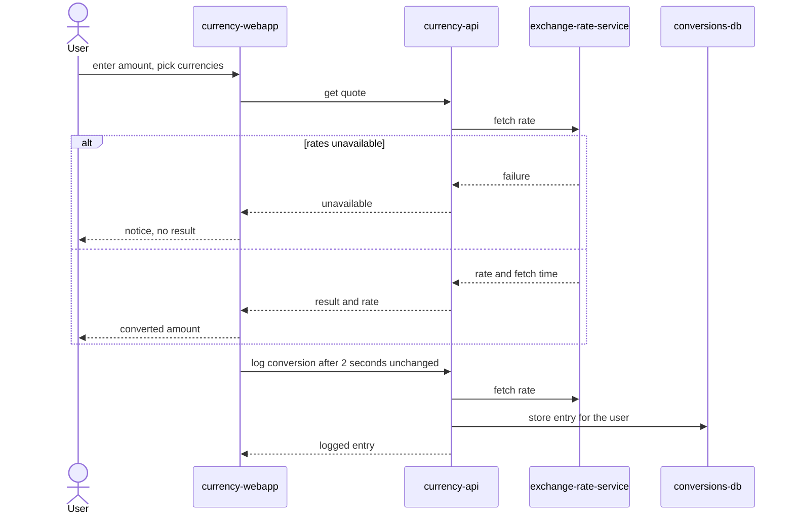

# Convert and log

A User converts an amount with a live rate, and the conversion is logged once the result has settled.

```mermaid
sequenceDiagram
    actor User
    participant currency-webapp
    participant currency-api
    participant exchange-rate-service
    participant conversions-db

    User->>currency-webapp: enter amount, pick currencies
    currency-webapp->>currency-api: get quote
    currency-api->>exchange-rate-service: fetch rate
    alt rates unavailable
        exchange-rate-service-->>currency-api: failure
        currency-api-->>currency-webapp: unavailable
        currency-webapp-->>User: notice, no result
    else
        exchange-rate-service-->>currency-api: rate and fetch time
        currency-api-->>currency-webapp: result and rate
        currency-webapp-->>User: converted amount
    end
    currency-webapp->>currency-api: log conversion after 2 seconds unchanged
    currency-api->>exchange-rate-service: fetch rate
    currency-api->>conversions-db: store entry for the user
    currency-api-->>currency-webapp: logged entry
```